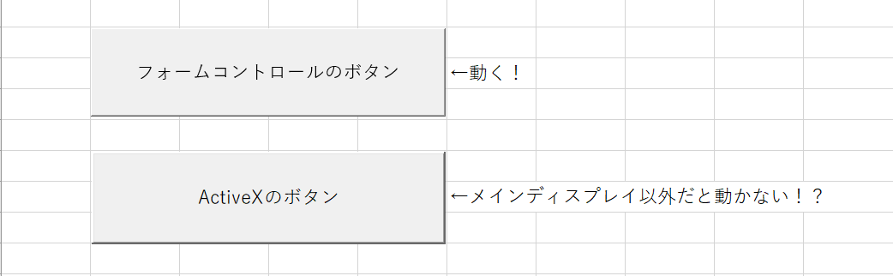

# 背景・動機
業務で使ってたExcelでマクロを実行しようとボタンを押しても何も起こらない、という時のための備忘録です。
今まで、何故か急に動かない→何もしてないのに治った、となっていてつい最近対処法が分かったので。

※Windows10、Excel2019の環境です。他の環境はわかりません（ビルド番号等は会社のPC上なので許して）。

# チェック項目
- [1. 2枚以上のディスプレイ作業している時](#1-2枚以上のディスプレイ作業している時)
- [2. windowsのアップデートの影響があるか調査する](#2-windowsのアップデートの影響があるか調査する)
- [3. キャッシュを削除してみる](#3-キャッシュを削除してみる)
- [4. Officeを修復してみる](#4-officeを修復してみる)
- [5. ここまでやって動かなければ](#5-ここまでやって動かなければ)

## 1. 2枚以上のディスプレイ作業している時
2枚以上のディスプレイを使っていませんか？（デスクトップPC+モニタ2枚 or ノートパソコン＋モニター1枚、etc...）
ボタンを押しても反応しないExcelを、メインのディスプレイに移動させて（※）もう1回ボタンを押してみてください。

……反応しました？

（※）：以下のようにして、どれがメインディスプレイかを判別できます。
1. windowsのデスクトップで右クリック
1. ポップアップメニューから「ディスプレイの設定(D)」をクリック
1. 「ディスプレイの選択と整理」でどれがメインかを確認する
    -  図の右下にある「識別」をクリックして「1」が表示されたディスプレイがメイン

こうなる原因は……わかりません。何故かActive Xのボタンはメインディスプレイ以外では正常に動作しないようです。

stackoverflowにて解決方法が2019年5月に投稿されている[1.1]のを見るにこの不具合は今後も解消されないと思います。

#### 参考
- 1.1: stackoverflow: [Excel Active-X button cannot be clicked](https://stackoverflow.com/questions/56265391/excel-active-x-button-cannot-be-clicked)
- 1.2: URK実験室とフォルテ君&サイクリング: [Excel ActiveXのボタンが拡張画面で動かない](https://ameblo.jp/urklabo/entry-12498651762.html)

---

以下の内容は検索するとわりと出てくる内容なので、優先度順で書き直しておきます。

## 2. windowsのアップデートの影響があるか調査する
ググるなりtwitterで検索するなりして、windows updateの影響がないか確認してみる。

ちなみにググると出てくる2021年とか2022年とかの内容は関係ないものとして無視してよい。

特にそこらの年のMicrosoftコミュニティの投稿はまず役立たない（回答があってもそれで解決したかのレスが無くて正しい方法かもわからない……）。

## 3. キャッシュを削除してみる
1. Excelをいったん閉じる（押せないファイルだけでなく、すべてのファイルを閉じる）
1. 以下のファイルを除去する（※無いこともある）：
    - `%USERPROFILE%\AppData\Local\Temp\Excel8.0\MSForms.exd`
    - `%USERPROFILE%\AppData\Local\Temp\VBE\MSForms.exd`
1. Excelを開きなおして押せるようになるか確認する

#### 参考
- 3.1: シスデイズ技術ブログ: [Excelマクロのボタンが押せなくなった](https://www.sysdays.co.jp/blog/article/4/)

## 4. Officeを修復してみる
1. 「プログラムと機能」を開く
    - windowsキー+R > `appwiz.cpl`と入力してエンター
1. 表示されたリストから「Microsoft Office ~」を右クリック > 「変更(C)」
1. 「クイック修復」を実行して完了したら確認
1. ダメならOfficeを入れなおす（たぶんオンライン修復をするより楽）

## 5. ここまでやって動かなければ
まだ未知の不具合かもしれません。情報系の詳しい人に泣きつくか今日は諦めましょう。

# 最後に
実は1.の内容が日本語のサイトで全然出なかった（参考リンク1.2のみ？）のでこの内容だけ残したくて記事にしました。

原因がわかる方はご教示願います。